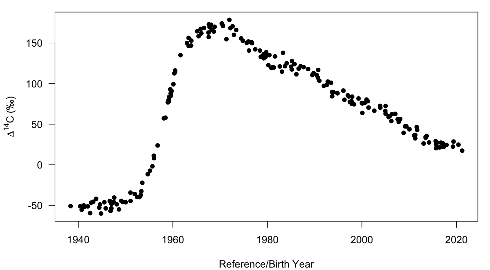
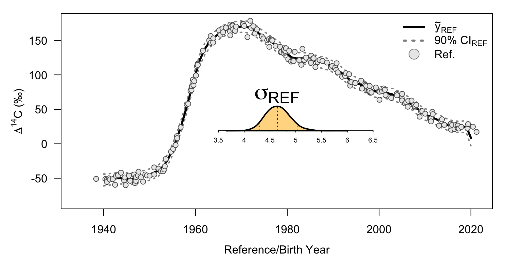
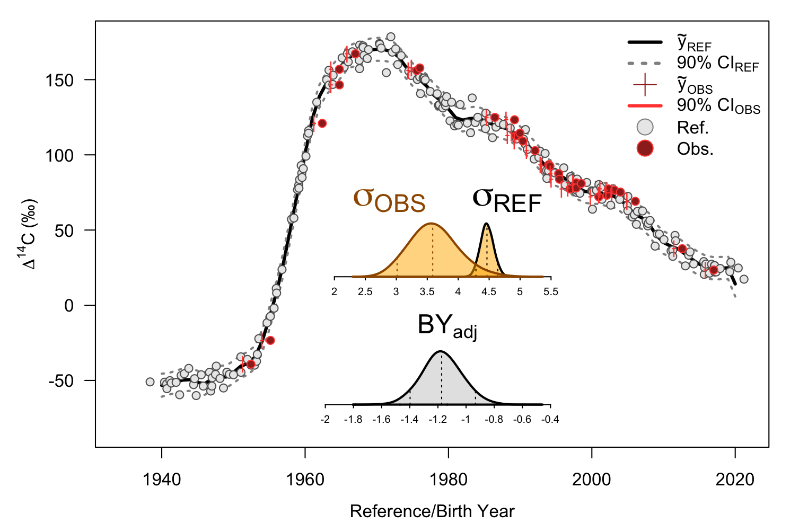

## Overview
Running BayesianBombCarbon on a given dataset involves several steps. The key step is preparing the data with teh `data_prep` function. This function takes both a reference series dataset and/or a sample dataset with unknown true formation/birth years. If the reference series is supplied only, the reference series is fit with a Bayesian penalized B-spline. If a sample dataset is also supplied, then a reference series is fit while also estimating the aging bias of the sample dataset. Users can also pre-determine the formation/birth years the model will predict the reference series over in the `data_prep` function. The function `est_model()` will take the prepared dataset and using `cmdstanr` fit the designated model while `extract_draws` will pull the relevant posterior parameter samples from the fitted model. Lastly, users can use `plot_fit` to visualize the predicted reference series, posterior parameter distributions, and, if sample data is supplied, the observed and bias-adjusted samples.

First, we must load the R library.

```r
library(BayesianBombCarbon)
```

## Reference series

### Using the provided simulated dataset
The provided dataset is a `data.frame` that was simulated from a hypothetical reference series with a damped oscillating linear decay function after the peak of ∆14C. Three columns are provided but only `BY` and `C14` are used by the `data_prep` function.


```r
# We can visualize the reference series data
with(sim_ref, plot(BY,C14, pch=16, xlab="Reference/Birth Year",
       ylab=expression(Delta^14*C~"(\u2030)")))
```
<div class="figure" style="text-align: center">

<p class="caption">plot of chunk sim_ref_viz</p>
</div>

### Preparing a reference series only dataset for estimation
To prepare a dataset for estimation, we need to provide at least one `data.frame` with named columns of `BY` and `C14` that provide the reference series data to the function `data_prep`. Internally, `data_prep` assesses what dataset(s) you've provided and generates a named list object with a two components, 1. a character vector in the `flag` component that tells other functions what model was setup and 2. a named list with the data parsed and matched the `stan` model format.

```r
df <- data_prep(df_ref = sim_ref)
#> No values provided in df_unk, skipping validation and estimating reference series only
```
We can also provide further specifications of the knots used in the penalized B-spline with arguments:
+ `knot.min` - sets the minimum number of knots, default of 10.
+ `knot.adj` - divisor in number of knots = number of reference series data points/knot.adj, default is 4. 
+ `fixed.knot` - integer number of fixed number of knots that overrides `knot.adj` calculation
+ `spline.degree` - polynomial degree, default is 3.
+ `pad.spline` - fraction of the range of formation/birth years in the reference series that is padded to the beginning and end of the knot locations, default is 1%.

We can also change the locations of the predicted reference series through the argument `pred.by`. Prediction is accomplished within the model in the `generated quantities` section in the `stan` model. We can either provide a vector of formation/birth years desired to `pred.by` or we can provided a named list to `pred.by` to set up a sequence call:
+ `min.by` - minimum year of the formation/birth year prediction sequence
+ `max.by` - maximum year of the formation/birth year prediction sequence
+ `inc.by` - formation/birth year increment of the prediction sequence

### Estimating a reference series only
Now that we have covered the data preparation, let's estimate the reference series. This function will also estimate other models by checking the `flag` component of the data list setup by the `data_prep` function. Additional arguments can be provided to `est_model` that control the behavior of the `cmdstanr::sample` call. Run `?cmdstanr::sample` to view the possible arguments. For most reference series, the default `cmdstanr::sample` arguments work fine. You may wish to set `parallel_chains` argument equal to the default number of `chains=4` to achieve parallel processing. Though, estimating reference-series only models is generally extremely fast (< 10 secs on the author's machine).

```r
fit <- est_model(data = df, show_messages = FALSE, show_exceptions = FALSE)
```
The `est_model` function returns a named list with `model` containing the `stan` model code that was sampled from and `fitted` which contains the output from `cmdstanr::sample`. Functions that work on `CmdStanMCMC` objects produced from `cmdstanr::sample` also work on this `fit$fitted` object.

```r
fit$fitted$summary(variables = c('C14_pred'))
#> # A tibble: 81 × 10
#>    variable     mean median    sd   mad    q5   q95  rhat ess_bulk ess_tail
#>    <chr>       <dbl>  <dbl> <dbl> <dbl> <dbl> <dbl> <dbl>    <dbl>    <dbl>
#>  1 C14_pred[1] -52.4  -52.6  5.18  5.17 -61.0 -44.1 1.00     4162.    4055.
#>  2 C14_pred[2] -52.0  -52.1  4.95  5.04 -60.2 -43.9 1.00     4041.    3736.
#>  3 C14_pred[3] -51.1  -51.0  4.92  4.80 -59.2 -43.0 1.00     3990.    3694.
#>  4 C14_pred[4] -50.2  -50.1  4.92  4.91 -58.2 -41.9 0.999    3778.    3718.
#>  5 C14_pred[5] -50.1  -50.1  4.94  4.92 -58.0 -41.7 1.00     3873.    3685.
#>  6 C14_pred[6] -50.8  -50.8  4.99  4.95 -59.1 -42.5 1.00     4062.    3688.
#>  7 C14_pred[7] -51.1  -51.1  5.10  4.99 -59.6 -42.9 1.00     4076.    3794.
#>  8 C14_pred[8] -49.5  -49.5  4.94  4.89 -57.7 -41.4 1.00     3745.    3586.
#>  9 C14_pred[9] -47.8  -47.8  5.03  5.13 -56.0 -39.6 1.00     3866.    3833.
#> 10 C14_pred[1… -46.9  -46.9  5.08  5.08 -55.4 -38.5 1.00     4187.    3873.
#> # ℹ 71 more rows
```

### Extracting posterior draws
Posterior draws of parameters can be accomplished by calling `cmdstanr::draws` on the `fit$fitted` `CmdStanMCMC` object produced through `est_model` or a wrapper function is provided as `extract_draws` that grabs the relevant parameters based on the the model type that was estimated. This wrapper function inherently skips over some of the nuisance parameters that are estimated pertaining to the knots in the penalized B-spline.

```r
ext <- extract_draws(fit = fit)
```

### Plotting fit
Lastly, we can visualize our model fit using `plot_fit`. This function takes both the data object from `data_prep` and the extracted draws from `extract_draws` to generate the plot.

```r
plot_fit(df = df, ext = ext)
```
<div class="figure" style="text-align: center">

<p class="caption">plot of chunk plot_ref_viz</p>
</div>

## Integrated method - reference series + unvalidated samples
`BayesianBombCarbon` also has an integrated method for jointly estimating the reference series and the aging bias present in a set of samples with unvalidated formation/birth years. In the penalized B-spline, this requires adjusting the knot contribution to each unvalidated sample each time a new aging bias (formation/birth year adjustment) is trialed. This massively increases the runtime but, in the author's biased opinion, is well worth the wait. The setup is very similar to the reference series only estimation.

### Integrated method data preparation
We can used the provided simulated reference series data in `sim_ref` and the accompanying unvalidated simulated samples in `sim_unk`. The latter have a fixed aging bias of +1 year. 


```r
# We can visualize the reference series data
with(sim_ref, plot(BY,C14, pch=16, xlab="Reference/Birth Year",
       ylab=expression(Delta^14*C~"(\u2030)"), las = 1))
with(sim_unk,points(BY,C14,pch=16,col='red'))
legend('topleft', legend = c('Reference','Test'), pch = 16, col = c('black','red'))
```

<div class="figure" style="text-align: center">

<p class="caption">plot of chunk sim_unk_viz</p>
</div>

We need to supply two `data.frames` both with named columns of `BY` and `C14`. One is the reference series, provided to argument `df_ref`, and another is the unvalidated samples, provide to arugment `df_unk` in the `data_prep` function.


```r
df_int <- data_prep(df_ref = sim_ref, df_unk = sim_unk)
```

An additional argument `ll_wt` is added to the `$data` object from the `data_prep` call that up-weights the reference series data relative to the unvalidated samples. This is to keep the reference series estimation from chasing the unvalidated samples. This is set at a default of 5 but if your reference series is very spotty where you have unvalidated samples, you may wish to increase this value. It has no associated runtime cost.

### Estimating an integrated penalized B-spline
Just as with the reference series estimation, we call `est_model` to estimate the integrated model. We do recommend adjusting the `cmdnstanr::sample` arguments when running the integrated model to at least increase the warmup iterations. We also recommend setting up parallel processing with the `parallel_chains` argument as these models have longer runtimes. You may also receive a warning that some transistions hit the maximum treedepth of 10. This can be resolved by changing the `max_treedepth` argument to > 10. 

```r
fit_int <- est_model(data = df_int, iter_warmup = 3000, parallel_chains = 4, show_messages = FALSE, show_exceptions = FALSE)
```

### Extracting posterior draws
Just as before, we can extract posterior draws using the `extract_draws` wrapper function. Note, that you should provide the `data_prep` object to the `df` argument so that an additional posterior will be generated of `BY_adj`, which adjusts the unvalidated formation/birth years by the posterior of the aging bias/adjustment.

```r
ext_int <- extract_draws(fit = fit_int, df = df_int)
```

### Hypothesis testing
With the posterior parameter draws of the integrated model, you can conduct formal hypothesis testing of whether your ages are valid. This is an explicit advantage of the integrated approach that traditional sum of square approaches do not have. To do this, we recommend the `bayestestR` package. 

```r
library(bayestestR)
p_map(ext_int$adj, null = 0)
```

```
#> MAP-based p-value
#> 
#> Parameter | p (MAP)
#> -------------------
#> adj       |  < .001
```
This returns the Bayesian equivalent of the *p*-value, see `?bayestestR::p_map` for more details. The argument `null` can be changed to also explicitly test other null ages and ask "is my aging bias significantly than X?". 

### Plotting fit
Lastly, we can visualize our integrated model using `plot_fit`.


```r
plot_fit(df = df_int, ext = ext_int)
```
<div class="figure" style="text-align: center">

<p class="caption">Visualization of reference function fit, adjusted unvalidated samples, and posterior distributions</p>
</div>

Note that additional features are plotted. The original unvalidated formation/birth years are shown in the red circles while the adjusted formation/birth years, along with their credible interval, are shown in the red ticks. Additional, the posterior densities of the aging bias/adjustment is provided. A vertical, dashed red segment will highlight zero if the posterior overlaps or is adjacent to zero. This provides a visual equivalent of the hypothesis test conducted earlier.

## Future work
`BayesianBombCarbon` is under development though the core functionality will remain mostly unchanged in the future. Additional models will be provided, such as the coupled function from Kastelle et al. (2011), that will have the reference series only and integrated method capabilities. General improvements have also been made to the sum of squares aging bias estimation approach, first presented in Kastelle et al. (2008), that will be supported soon. If you have suggestions/requests/bugs, please reach out to zsiders@ufl.edu. 


